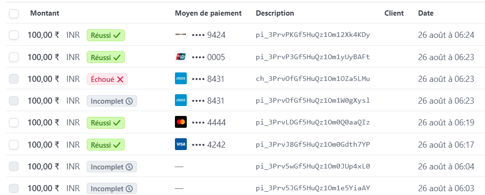

# Django Stripe Payment Integration

This repository contains a Django project integrated with Stripe to handle payments. The API allows users to create a payment intent and complete a payment using Stripe.

The API supports POST requests at the following endpoint: **payments/make_payment/**.

## Quick Start

To run the project locally:

```bash
# Clone this repository
git clone https://github.com/ATOUIYakoub/Stripe-Payment.git
cd Stripe-Payment

# Create and activate a virtual environment
python -m venv venv
source venv/bin/activate  # On Windows, use `venv\Scripts\activate`

cd stripe_payment
# Install the required dependencies
pip install -r requirements.txt

# Create a .env file
# Create a file named `.env` in the root directory of your project. Add the following lines to it:
SECRET_KEY=your_django_secret_api
STRIPE_SECRET_KEY=your_secret_key_here
STRIPE_PUBLISHABLE_KEY=your_publishable_key_here

# Run database migrations
python manage.py migrate

```bash
## Usage

### Testing with Postman

Create a Payment Intent:

Open Postman and send a POST request to payments/make_payment/. In the request body, include the Stripe test token in the following JSON format:


```bash
{
    "token": "tok_visa"
}

```bash
Use the Stripe test tokens for different scenarios. For example:

Test Token for a Successful Payment: tok_visa
Example of a Successful Payment Response:

If the payment is successful, you will receive a response like this:


```bash
{
    "status": "Success",
    "payment_intent": {
        "id": "pi_1Hw4f8L2H4n0STnXN7jXyLZy"
    },
    "payment_confirm": {
        "status": "succeeded"
    }
}

```bash
Screenshot
Below is a screenshot of a successful payment process:



Author
ATOUI Abderahman Yakoub | 2024